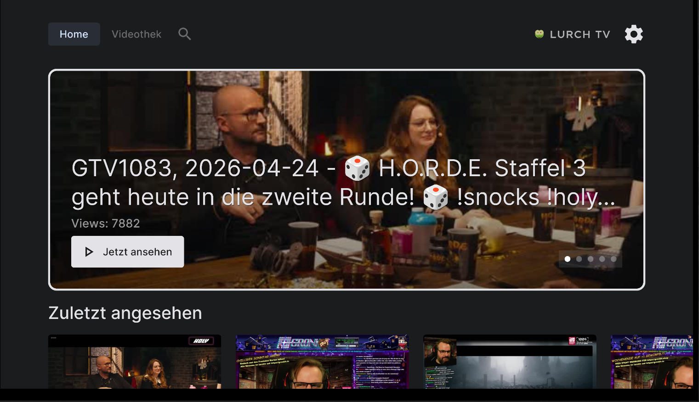
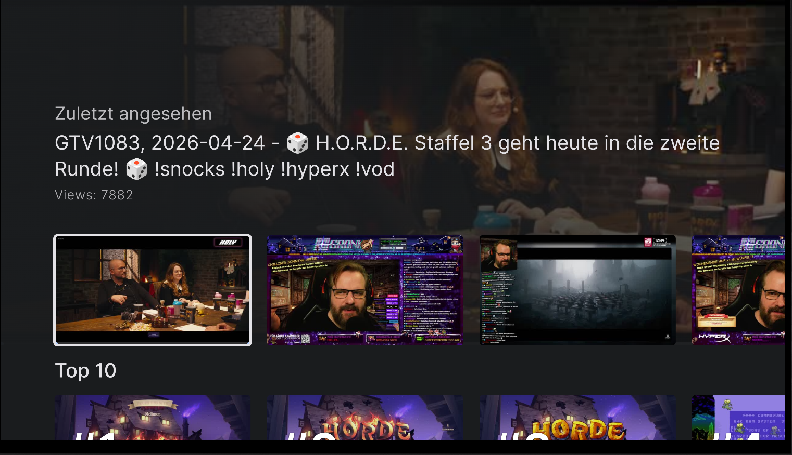
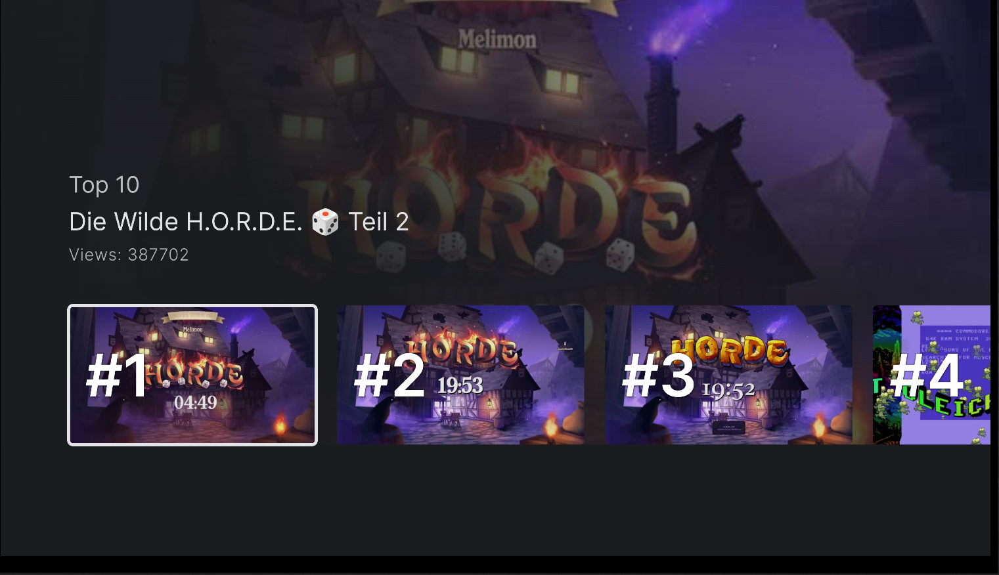
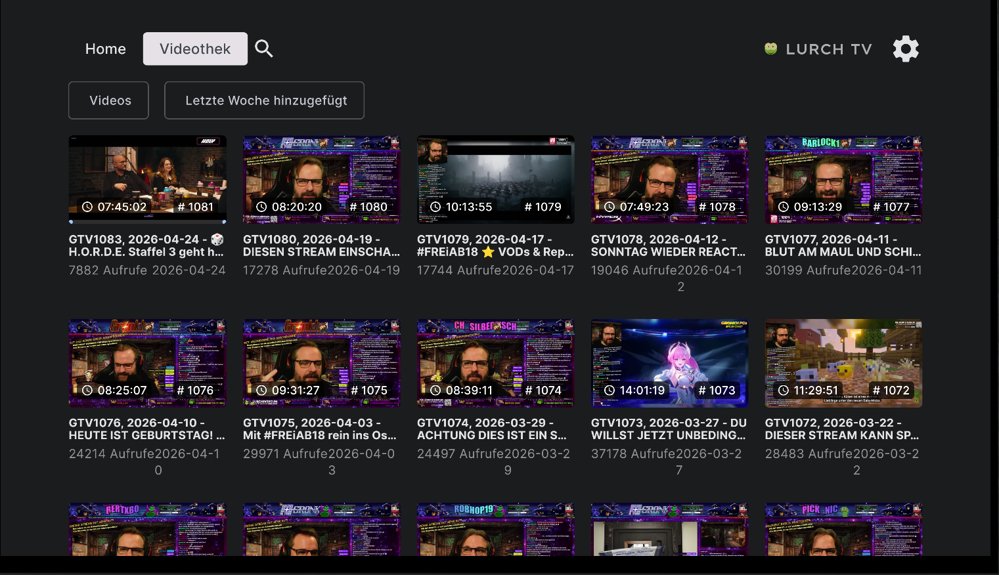
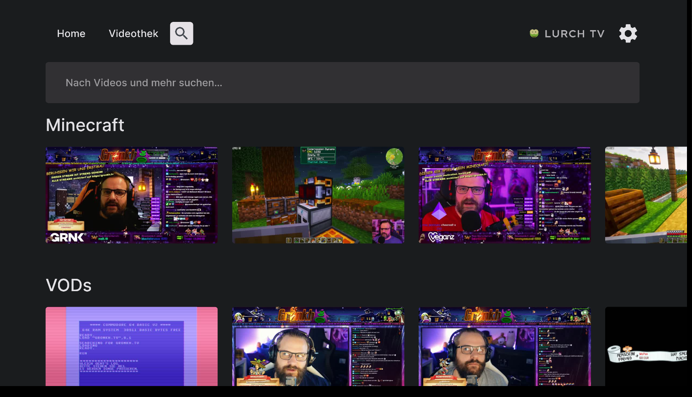
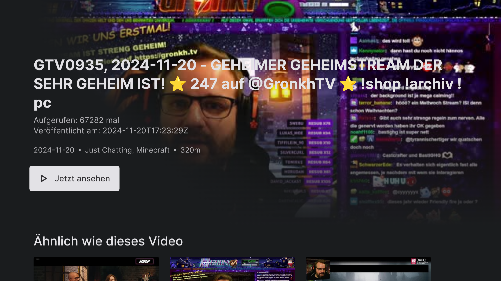

# LurchTV 📺

# ⚠️ BIG FAT DISCLAIMER ⚠️
**This is an UNOFFICIAL Android TV client for [gronkh.tv](https://gronkh.tv).**

This application is **fully vibecoded**. It is provided "as is" without any guarantees. Use it at your own risk. It has not been tested for compatibility with pets and **will probably eat your cats and dogs**. 🐱🐶🍔

---

## Screenshots
| Home (Featured) | Home (Recent) | Home (Top 10) |
| :---: | :---: | :---: |
|  |  |  |

| Videothek | Search | Video Details |
| :---: | :---: | :---: |
|  |  |  |

---

## About
LurchTV brings the Gronkh.tv stream archive and VODs to your Android TV with a modern, immersive interface.

## Features
- 🏠 **Home Screen**: Featured content, recent streams, and Top 10 discovery.
- 📚 **Videothek**: A searchable, filterable grid of all available VODs.
- 🔍 **Deep Search**: Categorized search results for games and VODs.
- 🎬 **Immersive UI**: Dynamic background thumbnails and rich metadata.
- 🎥 **HLS Playback**: High-quality streaming using Media3 ExoPlayer.

## Development
This project is built with:
- **Jetpack Compose for TV**: For the modern TV-native interface.
- **Media3 ExoPlayer**: For robust HLS stream handling.
- **Hilt**: For dependency injection.
- **Retrofit & Kotlin Serialization**: For live API integration.

## License
This project is for educational/personal use. All content is owned by [Gronkh.tv](https://gronkh.tv).
